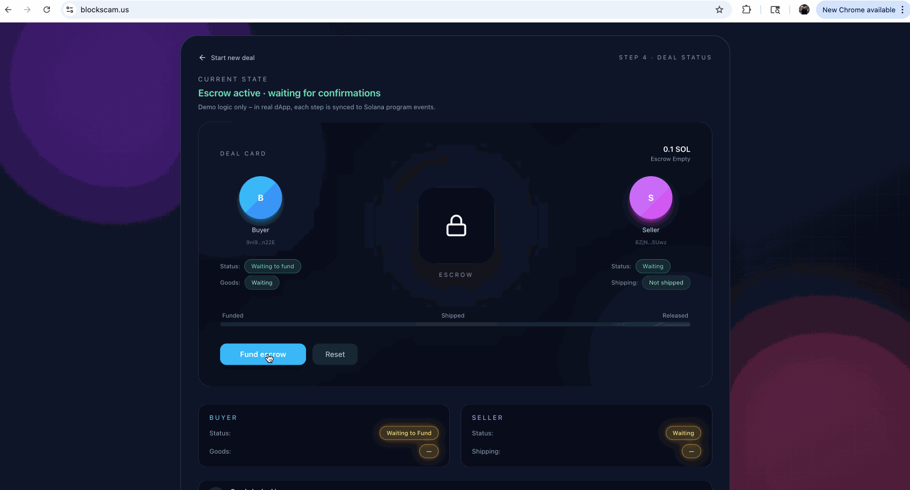
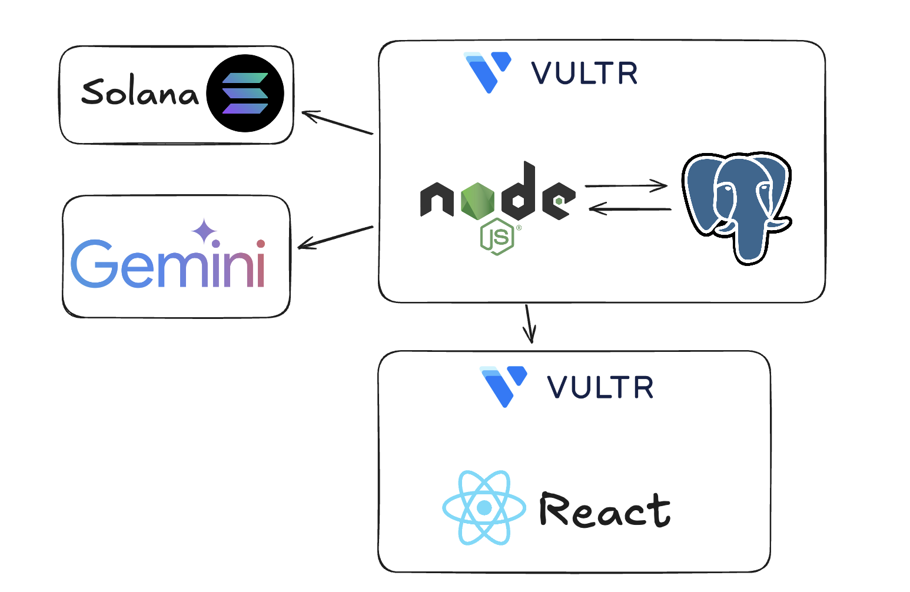

# ShopChain — Blockchain-Powered Safe Deals 

## Inspiration

Buying expensive items from strangers online — bikes, laptops, cameras, tickets, sneakers — always feels risky.  
You see a listing, you like the price, but something in your mind whispers:

> “What if this is a scam?”

Most platforms still rely on **trust**, screenshots, and hope.  
We wanted to replace **trust with verifiable safety**.

Our core idea was simple:

$$
Trust = Transparency+ Verification
$$

If we could combine **AI** (to evaluate risk) and **blockchain escrow** (to protect the payment),  
we could create a system where deals feel safe, predictable, and transparent — even between total strangers.

That is what inspired **ShopChain**.

---

## What It Does

ShopChain makes online peer-to-peer buying **safe**, **smart**, and **visual**.

### Listing Analysis

Paste any listing from Facebook Marketplace, eBay, Craigslist, Discord, WhatsApp — anything.  
ShopChain uses an NLU model to extract:

- Item name
- Price
- Delivery terms
- Seller behavior
- Missing or suspicious details

It then generates a **risk score** and a short explanation.

### Solana Escrow

If you decide to proceed, ShopChain creates a Solana escrow contract:

- Buyer funds the escrow vault
- Seller only gets paid after shipment
- If anything goes wrong, funds are refunded

### Interactive Deal Card UI

Both buyer and seller get a beautiful animated Deal Card showing:

- Buyer side vs seller side
- A central lock that “closes” when funded
- Coins moving during escrow operations
- Real-time status: _Funded → Shipped → Released_

It feels like a **real digital contract**.

---

## How We Built It

### **Blockchain — Solana Web3**

- Escrow vault contract
- Buyer → Escrow → Seller flow
- Refund path
- Deployed on devnet for demo stability

---

### **Frontend — React + Solana Wallet Adapter**

- Input for listing text/link
- Real-time risk display
- Dynamic risk bar
- Animated Deal Card
- Phantom wallet integration

---

### **Data collection, condensation, and Gemini AI interpretation**

- Using URL given in input (as stated above), we parse data from the product site
- Using variety of data optimization methods we simplify/shorten data to most relevant information for AI
- AI makes determination on risk given the necessary data

---

### **Deployment**

- Frontend on **Vultr**
- Backend and Hosting on **Vultr**
- **PostgreSQL** Database entirely on Vultr
- Solana programs on **devnet**

---

## Challenges We Ran Into

### 1. Messy Listings

Listings vary wildly — emojis, slang, broken grammar.  
We built preprocessing + heuristics to stabilize the NLU pipeline.

### 2. Solana Transaction Timing

Devnet confirmation delays caused UI desync.  
We added fallback states like:  
“**Waiting for transaction settlement…**”

### 3. Complex Animations

Synchronizing animations with real blockchain events required  
a clean state machine for each escrow stage.

### 4. Time Pressure

Building AI + blockchain + UI in a hackathon forced us to prioritize aggressively.

---

## Accomplishments We're Proud Of

- A working **Solana escrow system**
- A clean, helpful **AI risk analyzer**
- A fully animated **Deal Card UI**
- End-to-end flow: listing → analysis → escrow → release
- A project that feels like a **real product**, not just a prototype

---

## What We Learned

We learned:

- How to build real **trust infrastructure**
- How to integrate **LLMs** for structured information extraction
- How escrow systems operate behind the scenes
- How to manage complex frontend state tied to blockchain events
- Why UX and trust-signals matter for financial tools

We also learned that a small insight can grow into  
a powerful product with the right architecture.

---

## What’s Next for ShopChain

### Near Future

- Chrome extension: “Scan this listing”
- Fraud-detection ML trained on real scam datasets
- Shipment verification via QR scans + photo proof
- Stronger NFT proof system

### Long-Term Vision

We aim to transform ShopChain into a full Safety-as-a-Service ecosystem, where marketplaces, apps, and communities can instantly plug into our escrow, verification, and fraud-analysis APIs.
From small sellers to large platforms, anyone can add a single line of code to unlock trusted peer-to-peer commerce.
